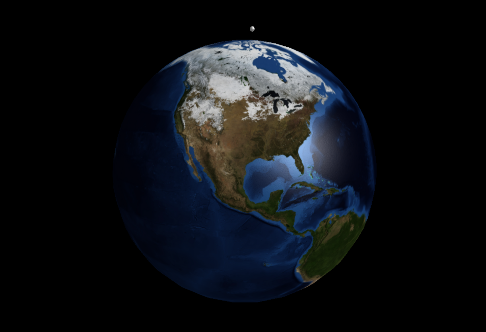
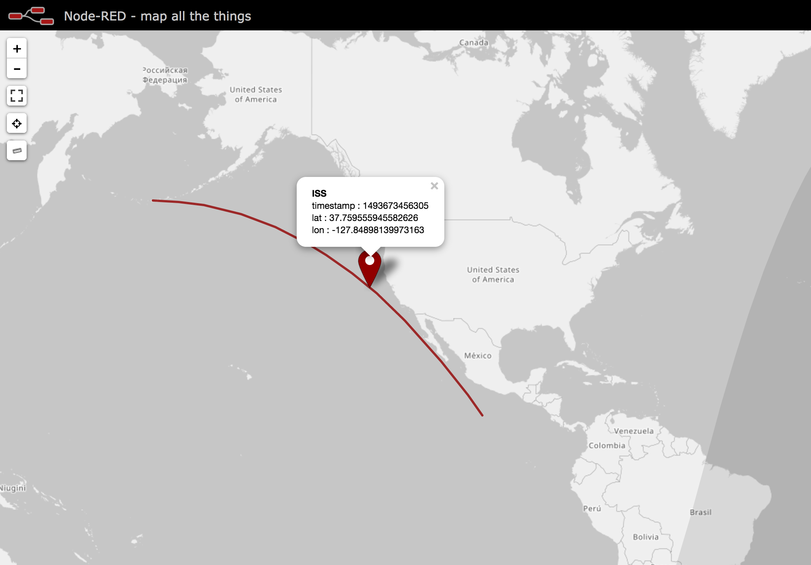

node-red-contrib-satellites (v0.2.1)
=============================

A set of <a href="http://nodered.org" target="_new">Node-RED</a> nodes to help working with Two-Line-Element (TLE) sets. Utilising the <a href="https://github.com/shashwatak/satellite-js">satellites.js</a> library to convert the TLE sets into <i>x, y, z</i> and <i>latitude/longitude</i> coordinates.
 
***note***: *Some of these implementations have a dependancy on the `node-red-contrib-web-worldmap` node.* 

### Known Issues

Earth Implementation

- I have had some trouble trying to get the Websockets to work correctly. I have overcome this by changing a few lines in the 'Earth.js' and 'satellites/satellites.js' files. 

 | 

This however creates conflicts between the Websockets of the Worldmap node and the Earth node. When using the Earth node like this, do not use the worldmap node. If you do by accident, then it may be necessary to remove the worldmap node and re-deploying, before closing all Node-RED related tabs and resetting the Node.js server.

- The position when showing a satellite in the 3d world is slightly offset in terms of the landmass it is above, depending on the latitude and longitude of the current position, the extent of the offset does vary.

- The 'Earth' node is quite computationally heavy, we're looking into the exact recommendations for the hardware to effectively run this node, in addition to how we can lighten the load on the machine.

Worldmap Implementation

- Markers across all layers can disappear, or fail to appear in the first place. In this instance, using the menu on the right-hand side, toggling the layers off and on again should make them re-appear.

- If using the Format Worldmap node with the satellite node, make sure that the coordinate system is not set to Euclidean 3D, as this will generate the following error:

In General

- The following aspects are known and being considered for integration at a later date: the trajectory is not displayed in the Earth node visualisation; the 'color' properties for the Worldmap and Earth nodes could be integrated into the satellite node; improvements to how the line segmentation is conducted; import 3D models in Collada format for use by the Eearth node to represent satellites.

- Windows: We are aware of some issues when running these nodes on Windows, and they are being investigated.

### Examples 
In the `./examples` folder you can find sample flows that demonstrate some use cases for this set of nodes. 

#### `./examples/ISS.json`

This flow will calculate the current *xyz* position of the ISS, using the relevant TLE data in the `satellite` node. The data is then fed into the `earth` node for visualisation.

#### `./examples/ISS-worldmap.json`

***note***: *This example has a dependancy on the `node-red-contrib-web-worldmap` node.* 

This flow will calculate the current position of the ISS, using it's TLE data in the `satellite` node, and convert it into the relevant formats for use with the `worldmap` node.

The `time array` node is used to calculate the timestamps for +/- 20 minutes from the current time, as to create the recent and upcoming path of the ISS. The use of the `switch` node and two `function` nodes converts the data into the right format for the `worldmap` node to render the route as a line and a single point, the latter of which shows the current position.
