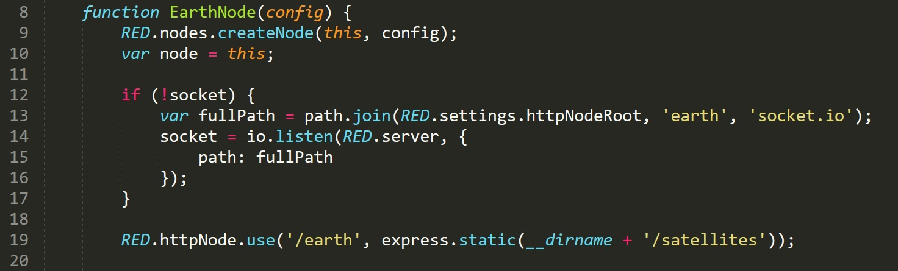
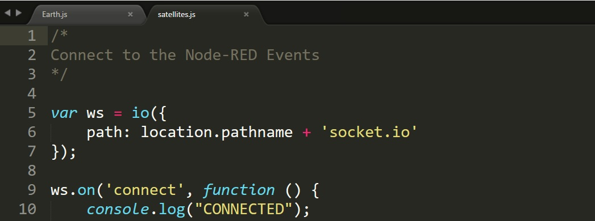
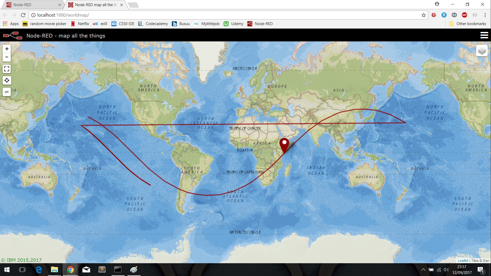
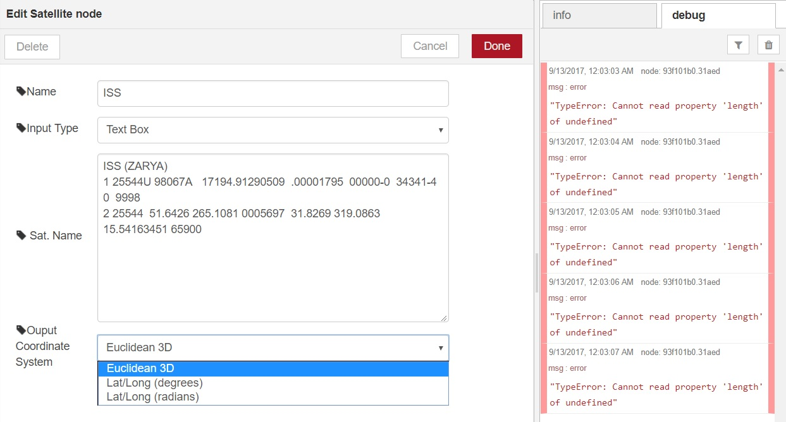
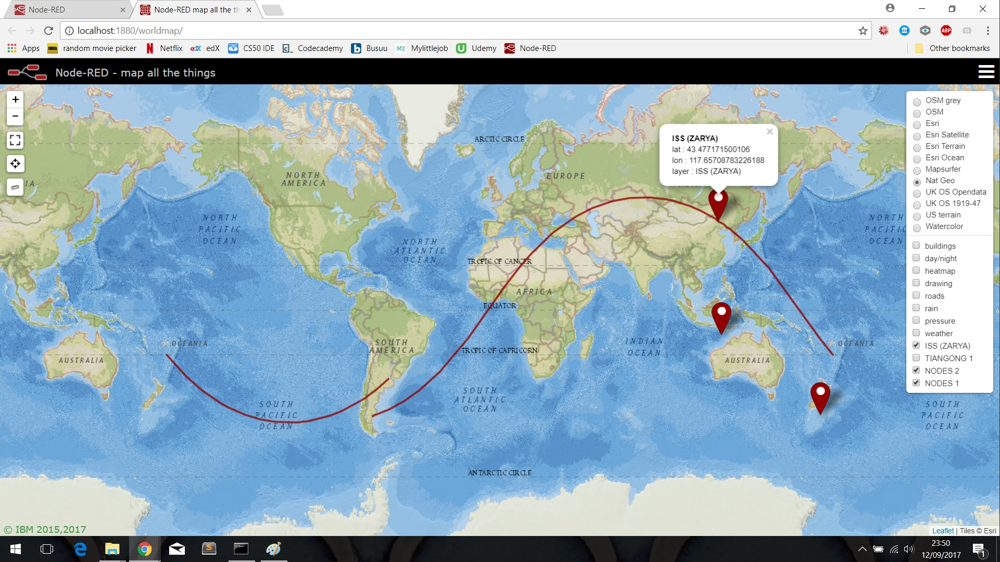

node-red-contrib-satellites (v0.2.1)
=============================

A set of <a href="http://nodered.org" target="_new">Node-RED</a> nodes for working with Two-Line-Element (TLE) sets. Utilising the <a href="https://github.com/shashwatak/satellite-js">satellites.js</a> library to convert the TLE sets into <i>x, y, z</i> and <i>latitude/longitude</i> coordinates.
 
***note***: *Some of these implementations have a dependancy on the `node-red-contrib-web-worldmap` node.* 

### Known Issues

Earth Implementation

- I have had some trouble trying to get the Websockets to work correctly. I have overcome this by changing a few lines in the 'Earth.js' and 'satellites/satellites.js' files. By commenting out line 15 of Earth.js, i.e. change `path: fullpath` to `//path: fullpath`, and changing lines 5-7 of satellites.js to just `var ws = io();`, the websockets would work. These lines of code in their current form are shown in the images below.

This however creates conflicts between the Websockets of the Worldmap node and the Earth node. When using the Earth node like this, do not use the worldmap node. If you do by accident, then it may be necessary to remove the worldmap node and re-deploying, before closing all Node-RED related tabs and resetting the Node.js server.

- The position when showing a satellite in the 3d world is slightly offset in terms of the landmass it is above, depending on the latitude and longitude of the current position, the extent of the offset does vary.

- The 'Earth' node is quite computationally heavy, we're looking into the exact recommendations for the hardware to effectively run this node, in addition to how we can lighten the load on the machine.

Worldmap Implementation

- Markers across all layers can disappear, or fail to appear in the first place. In this instance, using the menu on the right-hand side, toggling the layers off and on again should make them re-appear.

- Low resolution lines can make it difficult to segment the trajectories properly, resulting inglitches such as these:

- If using the Format Worldmap node with the satellite node, make sure that the coordinate system is not set to Euclidean 3D, as this will generate the following error: 

In General

- The following aspects are known and being considered for integration at a later date: the trajectory is not displayed in the Earth node visualisation; the 'color' properties for the Worldmap and Earth nodes could be integrated into the satellite node; improvements to how the line segmentation is conducted; import 3D models in Collada format for use by the Eearth node to represent satellites.

- Windows: We are aware of some issues when running these nodes on Windows, and they are being investigated.

### Examples 
In the `./examples` folder you can find sample flows that demonstrate some use cases for this set of nodes. 

#### `./examples/Timestamps_Earth.json`

Here, the flow takes the TLE data from four different satellites (ISS, TIAGONG, NODE1 and NODE2), and calculates the Euclidean 3d position of each satellite before visualising them on the 3D Earth view. 

A video demonstration of the nodes working can be seen here: [Vimeo](https://vimeo.com/233585944 "Satellites Node-RED Project")

#### `./examples/Timestamps_WM.json`
 

***note***: *This example has a dependancy on the `node-red-contrib-web-worldmap` node.* 

Here, the flow takes the TLE data from four different satellites. Firstly, a timestamp is received at a Time Array node, which creates an array of timestamps, taking `n` samples over a +/- time interval. These timestamps are then passed onto the ISS satellite node. Another satellite node, TIAGONG, only rececives a single timestamp. Finally, the satellite node representing both the satellites NODE1 and NODE2 does not receive a timestamp, but instead simply receives a boolean payload as a trigger.

Each of the satellites nodes separates out the different spacecraft before calculating their current latiitude and longitude position in degrees. Additionally for the ISS, the position of the ISS will be determined for all the timestamps provided from the Time Array node. The Format Worldmap node will then take this information and produce a string of messages which will output to a 2D map of the wolrd.The current position of satellites is shown by the markers, whilst the trajectories are drawn using a polyline. The markers and lines sorresponding to each satellite can be switched on/off by toggling the checkboxes in the layers menu (top right of map).

`./examples/File_input_WM.json` and `./examples/HTTP_input_WM.json` are similar example flows, which deomnstrate the use of dynamic inputs. ***note***: *It is not advisable to run these scripts whilst providing the entire list of satellites available at the CelesTrak source given below.*
- The file input, only availbale on locally run instances of Node-RED, requires a text file to be passed in using the appropriate node, which is then suitablly formatted as an input for the satellite node. The satellite node will then separate this into separate satellites and either corresponding line of TLE data.
- The HTTP input will request the text from <a href="https://www.celestrak.com/NORAD/elements/stations.txt">CelesTrak</a>, which is then formatted as an input for the satellite node. The satellite node will then separate this into separate satellites and either corresponding line of TLE data.
